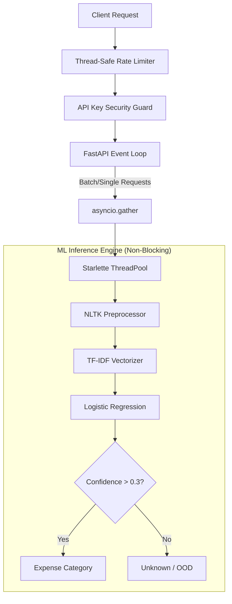

<div align="center">
  
  <h1>NextBill Invoice Expense Classifier</h1>
  <p><strong>Enterprise-Grade ML API for Autonomous Finance</strong></p>

  <p>
    
    
    
    
    
    
  </p>
</div>

---

## 📖 Overview

A production-ready, highly concurrent Machine Learning REST API that classifies raw invoice text into business expense categories. Built for **NextBill**, this service powers autonomous financial categorization for MSMEs with sub-millisecond inference latency.

This repository demonstrates **Staff-Level Software Engineering** practices, focusing on non-blocking event loops, memory safety, and threadpool optimization.

---

## 🏛️ System Architecture

Our architecture is designed for high throughput, low latency, and memory safety under load.



### Key Engineering Decisions:

1. **Non-Blocking ML Inference**: Scikit-Learn pipelines are CPU-bound. We offload inference to Starlette's worker threadpool using `run_in_threadpool`, completely freeing FastAPI's asynchronous event loop to handle concurrent I/O.
2. **Parallel Batch Processing**: The `/predict/batch` endpoint utilizes `asyncio.gather` to execute inference across the threadpool concurrently, rather than sequentially waiting for each prediction.
3. **Lock-Free Hot Paths**: The memory rate limiter operates with a background daemon thread for `O(N)` cache pruning. The hot request path maintains an `O(1)` lock duration, completely eliminating global lock contention under high request volume.
4. **Out-of-Distribution (OOD) Resilience**: Hard fallback mechanisms (`Confidence < 0.3 = Unknown`) prevent hallucinated categorization of nonsensical inputs.

---

## 🚀 Quick Start

### 1. Installation

```bash
git clone https://github.com/mohammed-shaz9/NextBill-Assignment.git
cd NextBill-Assignment
pip install -r requirements.txt
```

### 2. Model Training

```bash
# Generate 1500+ synthetic invoice descriptions
python -m data.generate_data

# Train the pipeline (GridSearchCV + TF-IDF + Logistic Regression)
python -m training.train_model
```

### 3. Launch Server

```bash
# Start the Uvicorn ASGI server
uvicorn app.main:app --host 0.0.0.0 --port 8000
```
> **Tip:** Visit `http://localhost:8000/` to view the custom FAANG-grade Developer Sandbox UI.

---

## 🔌 API Integration

Authentication requires the `x-api-key` header. 
*Default Dev Key:* `nextbill_dev_secret_key_2026`

### Single Prediction
```bash
curl -X POST "http://localhost:8000/predict" \
     -H "x-api-key: nextbill_dev_secret_key_2026" \
     -H "Content-Type: application/json" \
     -d '{"text": "AWS cloud hosting monthly invoice"}'
```

### Batch Prediction (Parallelized)
```bash
curl -X POST "http://localhost:8000/predict/batch" \
     -H "x-api-key: nextbill_dev_secret_key_2026" \
     -H "Content-Type: application/json" \
     -d '{"texts": ["Uber ride to airport", "Office printer paper"]}'
```

---

## 🛡️ Security & Reliability

| Feature | Implementation | Purpose |
|---------|----------------|---------|
| **CORS Shielding** | Restrictive `ALLOWED_ORIGINS` | Prevents unauthorized cross-origin browser requests. |
| **DDoS Protection** | Thread-safe Token Bucket | Rejects bursts > 60 req/min per IP without leaking memory. |
| **Env Guardrails** | Lifespan Startup Checks | Halts server if default developer keys are detected in `production`. |
| **Dependency Injection** | `Depends(get_classifier)` | Eager loads models into `@lru_cache`, ensuring zero disk I/O on the critical path. |

---

## 🐳 Docker Deployment

```bash
docker-compose up --build -d
```
*The container utilizes multi-stage builds and non-root users for production security.*

---
<div align="center">
  <i>Engineered for the NextBill AI Assignment.</i>
</div>
